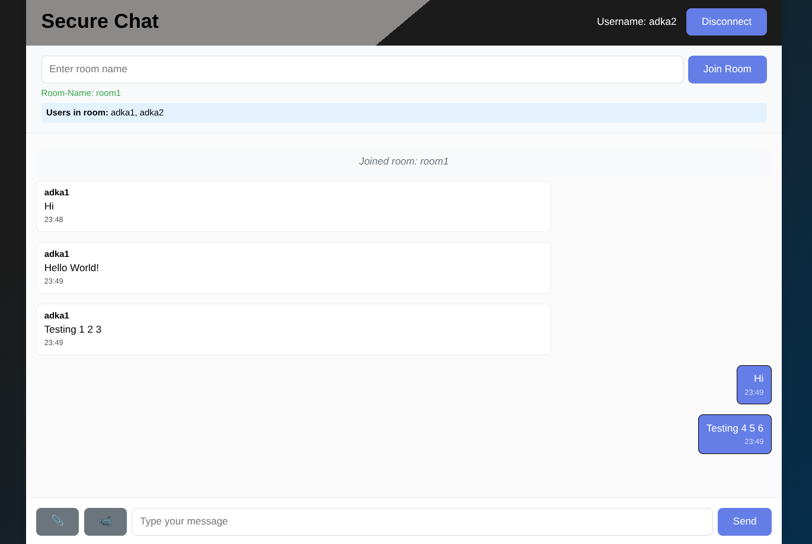

# Secure Chat App

A secure, real-time chat application built with Python Flask-SocketIO, HTML, CSS, and JavaScript. Features user authentication, AES encryption, file sharing, real-time video calling and room-based communication.

---

## Features

-  **User Authentication:** Secure user registration and login with bcrypt password hashing
-  **AES Encryption:** End-to-end AES-GCM encryption for all messages using Web Crypto API
-  **Secure Communication:** Real-time WebSocket chat with SSL/TLS support
-  **Room-based Chat:** Join and switch between chat rooms
-  **File Sharing:** Upload/download files (up to 10MB)
-  **Real-time Video Calling:** WebRTC-based group video calls with multiple participants
-  **Advanced Security:** Login attempt limiting, session management, and secure password storage
-  **ESP Client Support:** ESP devices can join as chat/file transfer clients *(coming soon)*
-  **Multi-user Support:** Multiple users per room
-  **Modern UI:** Responsive, animated interface

---

## Quick Start

### Prerequisites
- Python 3.7+
- MySQL/MariaDB server
- pip (Python package manager)
- Modern web browser with WebRTC support

### Required Python Packages
- flask==2.3.3
- flask-socketio==5.3.6
- python-socketio==5.8.0
- mysql-connector-python==8.1.0
- bcrypt==4.0.1
- flask-session==0.5.0
- pycryptodome==3.23.0

### Database Setup
1. Install and start MySQL/MariaDB server
2. Create database and user:
   ```sql
   CREATE DATABASE secure_chat_db;
   CREATE USER 'admin'@'localhost' IDENTIFIED BY '12345';
   GRANT ALL PRIVILEGES ON secure_chat_db.* TO 'admin'@'localhost';
   FLUSH PRIVILEGES;
   ```
3. Import the database schema:
   ```bash
   mysql -u admin -p secure_chat_db < setup_database.sql
   ```

### Option 1: Automated Setup (Recommended)
```bash
chmod +x setup.sh
./setup.sh
```

### Option 2: Manual Setup
```bash
python3 -m venv venv
source venv/bin/activate
pip install -r requirements.txt
```

### Running the Application
```bash
# Option 1: Using run script (Recommended)
chmod +x run_app.sh
./run_app.sh

# Option 2: Manual run
source venv/bin/activate
python server.py
```

Open your browser at `http://localhost:4000` (or your server IP).

---

## File Structure

```
secure-chat-app/
├── server.py              # Flask-SocketIO server with authentication & encryption
├── requirements.txt       # Python dependencies
├── setup.sh               # Setup script
├── run_app.sh             # Run script
├── setup_database.sql     # Database schema for user authentication
├── generate_cert.sh       # SSL certificate generation script
├── README.md              # This file
├── static/
│   ├── style.css          # CSS styling
│   ├── script.js          # Client-side JS with AES encryption
│   └── socket.io.js       # Socket.IO client (local)
├── templates/
│   └── index.html         # Main HTML template with auth forms
├── cert.pem, key.pem      # SSL certificates
└── venv/                  # Python virtual environment (not tracked by git)
```

---

## How to Use

### User Registration & Login
- **Register:** Create a new account with username (min 3 chars) and password (min 6 chars)
- **Login:** Sign in with your registered credentials
- All passwords are securely hashed using bcrypt

### Joining a Chat Room
- After login, enter a room name to join or create a room
- See the list of users currently in the room

### Secure Messaging
- All messages are automatically encrypted with AES-GCM before sending
- Messages are decrypted on the client side for display
- Real-time typing indicators show when others are typing

### File Sharing
- Click 📎 File to upload (max 10MB)
- Progress bar shows upload status
- Files are transferred in encrypted chunks
- Others can download shared files by clicking on them

### Real-time Video Calling
- Click 🎥 Video to start a group video call
- Multiple participants can join the same video call
- Audio and video controls: mute/unmute, camera on/off
- Grid layout automatically adjusts based on number of participants
- End call or close video modal to leave the call

### ESP Client Support
- ESP devices can connect as clients for chat and file transfer (feature coming soon)

---

## Technical Details

- **Backend:** Python Flask + Flask-SocketIO
- **Frontend:** Vanilla JS + HTML5 + CSS3
- **Communication:** WebSocket via Socket.IO
- **Authentication:** 
  - User registration and login system
  - bcrypt password hashing for secure storage
  - Session management with Flask sessions
  - Login attempt limiting (3 attempts per 5 minutes)
- **Encryption:** 
  - AES-GCM 256-bit encryption for all messages
  - Client-side encryption/decryption using Web Crypto API
  - Secure key management with random nonces
- **Database:** MySQL/MariaDB for user data storage
- **File Transfer:** Chunked, base64-encoded with real-time progress tracking
- **Video Calling:**
  - WebRTC-based peer-to-peer group video calls
  - Multiple participants support with grid layout
  - Audio/video controls (mute, video toggle)
  - STUN servers for NAT traversal
- **Security:**  
  - SSL/TLS support with self-signed certificates
  - Secure password storage with salt
  - Real-time encrypted communication
  - Input validation and sanitization
- **ESP Integration:** Custom protocol for ESP clients *(coming soon)*

---

## Security Features

### Authentication System
- **User Registration:** Secure account creation with input validation
- **Password Security:** bcrypt hashing with salt for password storage
- **Login Verification:** Database-backed authentication system
- **Session Management:** Secure session handling with Flask sessions
- **Input Validation:** Username and password requirements
- **Brute Force Protection:** Login attempt limiting (3 attempts per 5 minutes)
- **Session Timeout:** Automatic session cleanup and timeout handling

### AES Encryption Implementation
- **Algorithm:** AES-GCM (Galois/Counter Mode) for authenticated encryption
- **Key Size:** 256-bit encryption key
- **Client-Side Encryption:** Messages encrypted before transmission using Web Crypto API
- **Nonce Generation:** Cryptographically secure random nonces for each message
- **Tag Verification:** Built-in authentication tag prevents tampering
- **Real-time Protection:** All chat messages are encrypted end-to-end

### Network Security
- **SSL/TLS Support:** HTTPS connections with self-signed certificates
- **Secure WebSocket:** WSS (WebSocket Secure) for encrypted real-time communication
- **CORS Protection:** Controlled cross-origin resource sharing
- **WebRTC Security:** Secure peer-to-peer video communication with STUN servers

### Database Security
- **Prepared Statements:** SQL injection prevention
- **Password Hashing:** No plain-text password storage
- **Connection Security:** Secure database connection handling

---

## Customization

- **Colors:** Edit `static/style.css`
- **File size limit:** Change in `static/script.js`
- **Port:** Change in `server.py`
- **Add features:** Extend `server.py` and `script.js`

---

## Screenshots

### Login Screen


### Room Management


### Chat Interface


### File Transfer

---

## Browser Compatibility

- Chrome, Firefox, Safari, Edge (recent versions)
- WebRTC support required for video calling feature
- Web Crypto API support required for message encryption

---

## Troubleshooting

- **Connection Issues:** Check firewall, port, and browser console
- **Database Connection:** Ensure MySQL/MariaDB is running and credentials are correct
- **Authentication Problems:** Verify database schema is imported correctly
- **SSL/HTTPS Issues:** Check certificate files (cert.pem, key.pem) are present
- **File Upload Issues:** Ensure file <10MB, check browser console
- **Socket.IO Issues:** Use local `socket.io.js` for offline/CDN-restricted networks
- **Encryption Errors:** Check browser console for Web Crypto API support (requires HTTPS/localhost)
- **Video Call Issues:** Ensure camera/microphone permissions are granted, check WebRTC compatibility
- **Login Attempts:** If locked out, wait 5 minutes or restart server to reset login attempts

---

## License

This project is licensed under the Apache License 2.0 - see the [LICENSE](LICENSE) file for details.


